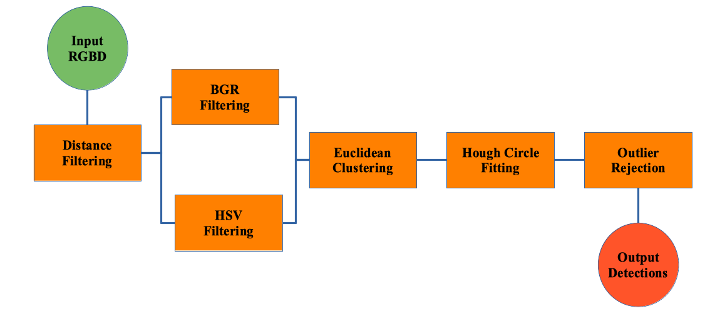
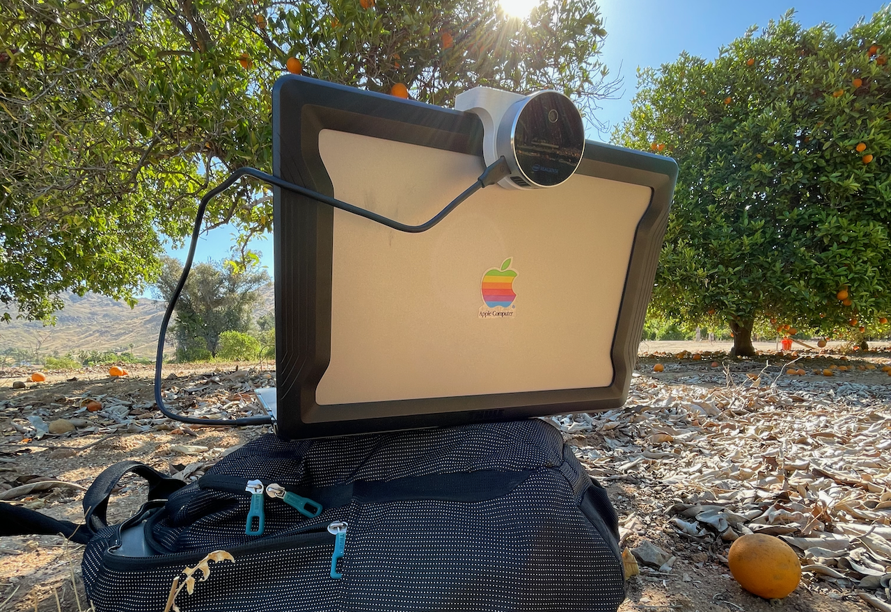

# Orange Detection

This project demonstrates an algorithm for using an RGB-D camera for detecting citrus fruit using a series of filters and clustering routines. This algorithm achieves a 34\% detection rate while averaging a computer time of 30ms per frame.


## Environment Setup

### Dependencies

Dependencies are installed using `brew`:

```sh
# Intel Realsense Camera API
brew install librealsense

# OpenCV Library
brew install opencv
```

After installing the dependencies, the location of the linked libraries can be found:

```sh
pkg-config --cflags --libs realsense2
pkg-config --cflags --libs opencv
```

### XCode Configuration

After the dependencies are installed, Xcode needs to be told where to find the libraries. This can be done by going to `Build Settings` then  editing the following parameters:

- Set Header Search Paths
- Set Library Search Paths
- Set Other Linker Flags

**Note:** packages installed by `brew` may not meet the requirements for a signed library as defined by Apple. This requirement can be overridden by going to: `Build Settings` then `Signing & Validation` and checking `Disable Library Validation`.


## Algorithm Structure

The citrus detection pipeline involves several steps. First, the depth image is used to segment the foreground and background of the color image. Then, two color filters are applied to remove the leaves (BGR, green channel rejection) while preserving (HSV, hue channel retention). Next, the remaining color pixels are grouped with Euclidean clustering to create candidate fruit blobs. A Hough circle fitting process is then used to detect the center of each fruit from the blobs and then estimate the radius. Finally, an outlier rejection filter removes candidates that do not fit the profile of a citrus.



## Input Data

The dataset necessary for algorithm development was collected using an Intel RealSense L515 RGB-D sensor in citrus groves. The L515 was attached to an Apple laptop with a 3D printed mount. While there is no use comparing apples and oranges, this configuration was an effective setup for data collection. The RGB-D was recorded to a ROSBAG for off-line algorithm development using the Intel RealSense Viewer.



## Running the Code

The software takes accepts the the following input arguments:

1. Path to a ROSBAG
1. Output save directory

If only the first argument is passed, no recording will be saved. If both the first and second arguments are passed, the output will be recorded automatically. If no arguments are passed, the code will run live using a connected RGB-D camera.


## References

### Intel Realsense Library

- [Intel API Overview](https://github.com/IntelRealSense/librealsense/wiki/API-How-To)
- [Intel RS-Convert](https://github.com/IntelRealSense/librealsense/tree/master/tools/convert)
- [Intel Examples](https://github.com/IntelRealSense/librealsense/tree/master/examples)
- [Intel DOXYGEN](https://intelrealsense.github.io/librealsense/doxygen/index.html)
- [Advanced Stream Alignment](https://dev.intelrealsense.com/docs/rs-align-advanced)

### General

- [Setting up OpenCV Development with Xcode](https://medium.com/@jaskaranvirdi/setting-up-opencv-and-c-development-environment-in-xcode-b6027728003)
